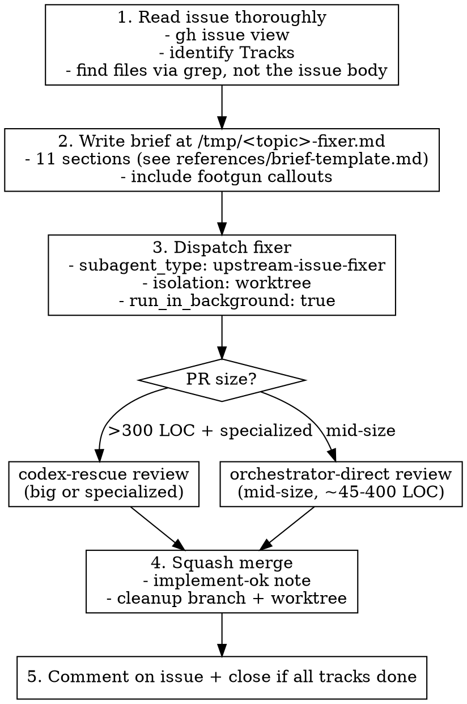

# Wave orchestration — parallel issue/PR ships

## When to use this skill

Use when:
- You have **2+ independent issues** open and the user wants them processed in parallel
- An issue is split into **Tracks A/B/C/D** and each track is potentially its own PR
- A PR is **>300 LOC + specialized domain** (Linux ACL, daemon scheduler, security primitives, etc.) and needs codex review for a second opinion
- A PR sits on a **third-party fork** (different `gh` user) and you need to push fix commits to that branch from your own session
- The user says "process the backlog", "ship these issues", "dispatch fixers", "wave 1/2/3", "Track A of #N", "needs-more on PR #N", or describes a set of GitHub issues they want batched without bundling into one mega-PR

Do NOT use when:
- A single small one-off bug fix → just edit and PR directly
- Architectural design discussion that needs the human → brainstorm first, do not dispatch
- Refactor with >5 file moves and ambiguous scope → write a plan first, get user signoff, *then* maybe dispatch
- The work fits comfortably in 50 LOC and the user is online to review interactively

## Why this pattern exists

Sequential long-lived reviewer agents (one Codex session that reviews every PR back-to-back) accumulate ~3 review rounds per PR and ~150 minutes per 5 PRs. Replacing that with **wave-sized ephemeral fixers + targeted codex-rescue review** drops to ~25 minutes per wave with zero regressions across waves. The win is that each wave is small enough to land r1 `implement-ok` 90%+ of the time, and parallel dispatch hides the per-fixer wall time behind whatever the orchestrator is doing next.

## Core pattern



## Step 1 — Read the issue thoroughly

```bash
gh issue view <N> --json title,body --jq '"# \(.title)\n\n\(.body)"'
```

Identify:
- **Track structure** (A/B/C/D? landing in one PR or split into multiple waves?)
- **Concrete files to touch** — verify by grepping the actual repo (`find` / `rg`); the issue body sometimes refers to files that don't exist or have moved
- **Out-of-scope items** the brief must explicitly forbid (over-scoping is the #1 reason r2 review rounds happen)
- **File overlap with other open PRs** — if two waves would both touch `lib/foo.sh`, serialize them

Don't skip this step. A brief written from a misread issue wastes the entire fixer dispatch.

## Step 2 — Write the brief

Briefs go to `/tmp/<topic>-fixer.md` and run ~150-300 lines. The full template is in `references/brief-template.md`. Required sections in order:

1. Repo / branch / scope
2. Read first (do not skip)
3. What to change (per-file recipe)
4. Out of scope (do NOT do)
5. Verification (exact bash commands the fixer must run)
6. CI status (note pre-existing failures so the fixer doesn't waste time on them)
7. PR opening (title, body shape, auth switch, `--no-maintainer-edit`)
8. CRITICAL — close-keyword footgun warning (see `references/footguns.md`)
9. Stop point (where to halt, what to return)
10. Reminders (worktree-relative paths, single commit, no VERSION/CHANGELOG)
11. Output (JSON schema)

The brief is the contract. Vague briefs produce r2 rounds. Concrete briefs land r1.

## Step 3 — Dispatch the fixer

This skill bundles a project-agnostic `issue-fixer` agent at `agents/issue-fixer.md`. It is **not auto-installed** — Claude Code does not pick up skill-bundled agents into the main `Agent` tool's `subagent_type` field by default.

### Install the bundled agent (one-time)

```bash
# user-level install — available across all your Claude Code sessions
mkdir -p ~/.claude/agents
cp ~/.claude/skills/wave-orchestration/agents/issue-fixer.md ~/.claude/agents/issue-fixer.md
```

After this, `subagent_type: "issue-fixer"` is available.

### Dispatch (preferred — when the bundled agent is installed)

```javascript
Agent({
  description: "Wave N: <issue> Track <X>",
  subagent_type: "issue-fixer",
  prompt: <self-contained-prompt-pointing-at-brief-file>,
  isolation: "worktree",
  run_in_background: true
})
```

### Fallback dispatch (when the bundled agent is NOT installed)

`general-purpose` works as a substitute when paired with a sufficiently detailed brief. The brief must do more lifting because `general-purpose` has no built-in single-issue contract:

```javascript
Agent({
  description: "Wave N: <issue> Track <X>",
  subagent_type: "general-purpose",
  prompt: `You are dispatched as a single-issue fixer. Read the brief in full first: /tmp/<topic>-fixer.md
The brief specifies: repo, issue number, branch, files to edit, verification matrix, JSON return schema, footgun callouts.
Work autonomously per the brief. Stop at commit (or PR open per brief). Return the JSON schema the brief specifies.

Critical conventions the brief reinforces:
- Worktree-relative paths only (never absolute paths into operator's primary checkout)
- Smallest focused edit; don't refactor adjacent code
- Don't write \`closes #<N>\` in commit subject or PR title — GitHub's close-keyword regex is greedy
- Single commit, no VERSION/CHANGELOG bump unless the brief explicitly asks
- Verify before committing per the brief's matrix; failed verification → don't commit, return failure with evidence`,
  isolation: "worktree",
  run_in_background: true
})
```

Either way, critical flags:
- `isolation: "worktree"` — fixer runs in an isolated git worktree at `<repo>/.claude/worktrees/agent-<hash>/`. Without this, the fixer can mutate your primary checkout. **This is footgun #1.**
- `run_in_background: true` — main session continues while fixer works; you get a notification on completion. Do not block.
- The `prompt` field is a **brief overview**, not the brief itself. Refer to `/tmp/<topic>-fixer.md`. Keep dispatch prompts under 50 lines.

### Project-specific fixer (when you have one)

Some repos ship their own specialized fixer (e.g., Agent Bridge has `upstream-issue-fixer` with hardcoded `BRIDGE_HOME` / smoke conventions). When operating on a repo with a specialized fixer, use that instead — it has built-in awareness of the project's verification matrix and won't need the brief to spell out as much. The bundled `issue-fixer` is the **portable default** for repos without a dedicated agent.

## Step 4 — Review

### Reviewer selection — DEFAULT IS codex-rescue PAIR-REVIEW

**Pair-review every non-trivial PR.** Default reviewer is `codex-rescue` (or whichever pair-reviewer the project's `AGENTS.md` / contributing docs designate, e.g., `agb-dev-codex-2` on Agent Bridge). Merge **only after** the reviewer's note opens with `implement-ok`. This is the project-level rule on most repos that ship an `AGENTS.md`; it overrides the orchestrator's preference.

| PR size / scenario | Reviewer | Notes |
|---|---|---|
| Any non-trivial PR (>~10 LOC, any domain) | **codex-rescue** | Default. Always pair-review unless project docs explicitly authorize direct review. |
| Trivial mechanical revert / typo fix / single-line doc change | direct OK | Operator can usually verify by eye; codex-rescue overhead is wasted. State the rationale in the merge note. |
| Operator explicitly orders direct review for this PR | direct | Annotate the merge note with "operator-directed direct review" and the reason. |
| author = fork | post review as PR comment, then iterate via author or push fixes from fork account | Cross-fork PRs use the same pair-review contract. |

**Why the rule is `codex-rescue first`**:
1. Most projects with multi-agent contributors (the kind of repo this skill targets) have an `AGENTS.md` rule like "Pair-review every non-trivial PR. Merge only after implement-ok." That rule **overrides** the orchestrator's "direct review for <300 LOC mid-size" instinct.
2. Direct review by the orchestrator is high-trust but single-actor. Pair-review with codex-rescue catches semantic bugs (missing reschedule, leaked secrets, broken finalize paths) that orchestrator review under context pressure misses.
3. Operator-directed reverts of "merged without pair-review" PRs cost more time than the pair-review would have. Real instance: 2026-04-26 — three PRs reverted because the orchestrator skipped codex review citing the (then-existing) <300 LOC carve-out. Don't be that orchestrator.

**Do not invent carve-outs**. If you find yourself rationalizing "this is small enough to skip review", check the project's `AGENTS.md` first. If the rule says "every non-trivial PR", skip is allowed only for the trivial-mechanical category in the table above.

### codex-rescue dispatch — must include the wait-for-completion line

```javascript
Agent({
  description: "Codex review of <PR>",
  subagent_type: "codex:codex-rescue",
  prompt: `... brief + diff path + PR body + checklist ...

Wait for completion in your final assistant message. Do not return a thread id and exit.`,
  run_in_background: true
})
```

If you omit "Wait for completion in your final assistant message", codex-rescue is async-default and returns an empty thread id, which is useless. **This is footgun #8 — every other dispatch hits it.**

Before dispatching codex-rescue, verify codex is set up:

```bash
codex --version 2>/dev/null && command -v codex   # confirm codex CLI is installed and on PATH
```

If `codex` is not on the agent's PATH (homebrew installs to `/opt/homebrew/bin` on macOS, `/usr/local/bin` on Linux), the fixer may incorrectly report "Codex CLI is not installed" — re-dispatch with explicit `PATH` guidance, or invoke codex directly via its absolute path.

### Direct review for mid-size PRs

```bash
gh pr diff <N>
```

Verify:
- Every brief acceptance criterion is met
- No unintended files were touched (worktree path footgun)
- VERSION/CHANGELOG untouched (release contract)
- Verification commands in the brief actually pass

If satisfied, squash merge with a structured note (see Step 5).

### Pair-review loop for `needs-more`

If the reviewer returns `needs-more: ...`:
1. Post the review verbatim as a PR comment.
2. Write `/tmp/<topic>-r2-fixer.md` listing each finding with **file:line** citation and a concrete fix recipe — do not paraphrase.
3. Dispatch a fresh fixer (not the same one) with the r2 brief.
4. After 3 rounds without `implement-ok`, **stop and reconsider scope**. Often the PR is too big or the spec is ambiguous; split it.

## Step 5 — Squash merge with structured note

```bash
gh pr merge <N> --squash --body "$(cat <<'EOF'
implement-ok

<reviewer-context: direct or codex-rescue>

Verified:
- <acceptance criterion 1>
- <acceptance criterion 2>
- ...
- No VERSION bump, no CHANGELOG entry — release contract preserved
- Single commit, <N> file(s)
- PR title uses '(#<N> Track X)' — close-keyword footgun avoided

<issue-stays-open-or-closes context>

Approved.
EOF
)"
```

The `implement-ok` opener is the convention — reviewer agents and human reviewers both grep for it. Always start with that literal string.

After merge:

```bash
git -C <repo> pull --ff-only origin main
git -C <repo> worktree remove -f -f <repo>/.claude/worktrees/agent-<hash>
gh api -X DELETE /repos/<owner>/<repo>/git/refs/heads/<branch>
```

`gh pr merge --delete-branch` fails when local main is checked out in a worktree (`fatal: 'main' is already used by worktree`). Skip the `--delete-branch` flag and use the `gh api` call to delete the remote ref directly.

## Step 6 — Comment on the issue

If the PR closes the issue, GitHub auto-closes via the `closes #N` keyword (see footgun #2 — be careful). Otherwise, comment on the issue summarizing what landed and which tracks remain:

```bash
gh issue comment <N> --body "Track X landed in PR #<M> (\`<short-sha>\`).

<one-paragraph what-changed>

Tracks Y, Z remain open. Closing once those are addressed or explicitly deferred."
```

When all tracks land:

```bash
gh issue close <N> --comment "All tracks landed. ..."
```

## Footgun catalog

8 footguns have all bitten me. Each has cost a session's worth of recovery. **Read `references/footguns.md` before dispatching; have it open while reviewing PRs.**

Quick summary:
1. Worktree path leakage (absolute paths in brief)
2. GitHub close-keyword regex (`closes #283 Track B` → closes #283)
3. `gh auth` account mismatch (cross-fork PR fails on wrong account)
4. VERSION/CHANGELOG bleeding into feature PRs
5. macOS Bash 3.2 vs Bash 4+ (`source bridge-lib.sh` vs `source ./bridge-lib.sh`)
6. Committed source vs heredoc-generated content (brief targets wrong file)
7. Cross-fork PR push from fork account (not new branch)
8. codex-rescue async-default (missing wait-for-completion line)

## Wave size — parallelism is the default, not the exception

**Always parallelize independent fixers.** A single sequential fixer chain is a wasted hour every time. The default mental model: scan the open backlog, identify which items have non-overlapping file surfaces, write a brief per item, and dispatch them all in **one message with multiple Agent tool calls** (the tool runtime fans out only when the calls are in the same response — sequential dispatch in successive turns serializes them).

### Sizing rules

- **Sweet spot: 2-4 fixers per wave.** Each fixer is in its own `isolation: "worktree"`, so no shared state. Larger waves (5+) hit your own context-budget pressure when reviewing returns; if you have more independent work than that, dispatch the second batch as soon as the first batch's reviews start landing.
- **Same-file conflicts force serial execution.** Before dispatching, list each fixer's expected file touches and check for overlaps. Two fixers writing to the same `lib/foo.sh` will both succeed individually but the second-merging PR has to rebase. Acceptable for unrelated functions in a long file (just rebase at merge); not acceptable for the same function or block.
- **One brief per fixer at `/tmp/<topic>-fixer.md`.** Briefs are written and saved before any dispatch. The dispatch prompt is a 30-50 line overview pointing at the brief; the fixer reads the brief on first turn.

### Dispatch idiom (ONE message, multiple Agent calls)

```javascript
// All three of these go in a SINGLE assistant turn.
// Sending them across three separate turns would serialize them.
Agent({ description: "Wave: #A", subagent_type: "issue-fixer", prompt: <points-at-/tmp/A-fixer.md>, isolation: "worktree", run_in_background: true })
Agent({ description: "Wave: #B", subagent_type: "issue-fixer", prompt: <points-at-/tmp/B-fixer.md>, isolation: "worktree", run_in_background: true })
Agent({ description: "Wave: #C", subagent_type: "issue-fixer", prompt: <points-at-/tmp/C-fixer.md>, isolation: "worktree", run_in_background: true })
```

The orchestrator can also have a fixer running while it dispatches *new* fixers in subsequent turns — the parallelism comes from `run_in_background: true`, not from same-message dispatch alone. But same-message dispatch is the cleanest signal of intent and avoids accidental serialization when you're triaging multiple briefs at once.

### What's safe to parallelize

| Scenario | Parallel? | Notes |
|---|---|---|
| Two fixers touching wholly disjoint files | yes | The default safe case |
| Two fixers touching different functions in the same file | yes | Worktree isolation handles it; merge order may need rebase |
| Two fixers touching the same function | no | Serialize; the second waits for the first to merge so its base is current |
| Docs PR + code PR in the same area | yes | Different surfaces; review independently |
| Fixer + codex-rescue review of an existing PR | yes | Different actors; codex review doesn't write to the worktree |
| 3+ fixers all touching `lib/bridge-core.sh` | partial | Fan out 2 max with the explicit acknowledgement that the third will rebase; consider whether some can be combined into one fixer |

### Backlog scan pattern

When the user says "process the backlog" or "do the next wave":

1. `gh issue list --state open --limit 30` and `gh pr list --state open --limit 10`
2. Triage by **scope** (small/mid/large) and **surface** (which files each touches)
3. Bucket into waves — pack 2-4 small/mid items with disjoint surfaces into the next wave
4. Defer any item that requires user input (design discussion, breaking-change confirmation, brainstorm)
5. Defer any item that requires a reproducer the host can't run (e.g., `linux-user` isolation tests on macOS)
6. Write all briefs first, then **dispatch the whole batch in one message**

### After a wave

- Pause to: verify all PRs landed, run cross-PR regression checks if any pair touched related areas
- Order squash-merges if there are file-overlap conflicts (smaller / earlier-completing PR first; the second rebases against current main)
- Update memory if patterns shifted (new footgun, new tooling, new naming convention)

## Verification before completion (every PR)

Don't claim "done" without:
- `bash -n` on every touched `.sh` file
- `shellcheck` on every touched `.sh` file (warnings OK; errors not OK)
- `python3 -c "import ast; ast.parse(open('<file>').read())"` on every touched `.py` file
- Live test of any new helper function via fresh bash + source `./bridge-lib.sh` (note the `./`)
- `git diff --cached --stat` before commit — confirm only the intended files are staged
- `gh pr diff <N>` after PR open — confirm fixer didn't touch unintended files (worktree path footgun)

## Reference files

- `references/brief-template.md` — fully worked brief template with section-by-section rationale
- `references/footguns.md` — all 8 footguns with reproduction, root cause, and fix instructions
- `references/recipes.md` — concrete recipes: cross-fork push, codex setup verification, worktree cleanup, releasing PR conventions
- `references/wave-examples.md` — 4 worked waves from the Agent Bridge repo (#306 docs, #311 fixture cleanup, #313 generator, PR #302 r2)

## Bundled agent

- `agents/issue-fixer.md` — project-agnostic single-issue fixer. **Not auto-installed.** Copy to `~/.claude/agents/issue-fixer.md` for user-level install, or to `<repo>/.claude/agents/issue-fixer.md` for repo-level install, to make `subagent_type: "issue-fixer"` available. Fall back to `general-purpose` per Step 3 above when neither install is present.

Agents created via `agent-bridge` (the Agent Bridge multi-agent orchestrator) inherit the repo's `.claude/skills/` and `.claude/agents/` automatically, so when this skill ships in the Agent Bridge upstream every dynamic / static agent picks it up on next bootstrap. No manual copy step required for those agents.

## Agent Bridge integration

When the orchestrator is itself an Agent Bridge agent (claude or codex), there are two distinct dispatch surfaces:

1. **Agent tool dispatch** (claude only) — what this skill describes throughout. `Agent({ subagent_type: "issue-fixer", isolation: "worktree", run_in_background: true })` spawns an ephemeral subagent in an isolated git worktree. Best for parallel waves of independent fixers.
2. **Bridge queue dispatch** (claude + codex) — `bash bridge-task.sh create --from <self> --to <peer-agent> --title "..." --body-file /tmp/<topic>-fixer.md` enqueues work for a long-lived peer (e.g., the codex pair partner). Best for cross-engine collaboration where the queue's persistence + audit trail matter, and for codex agents that don't have the `Agent` tool.

Both surfaces are compatible with the same brief format. The dispatching brief is the contract; the surface is just how the brief reaches the executor.

For codex-rescue review specifically (Step 4), claude orchestrators use `Agent({ subagent_type: "codex:codex-rescue", run_in_background: true })`. Codex orchestrators delegate review to their claude pair via the bridge queue (`bridge-task.sh create --to <claude-pair> --title "[review PR #N]"`).

Read these on demand; the SKILL.md above is the orchestration spine and should stay under 300 lines.
