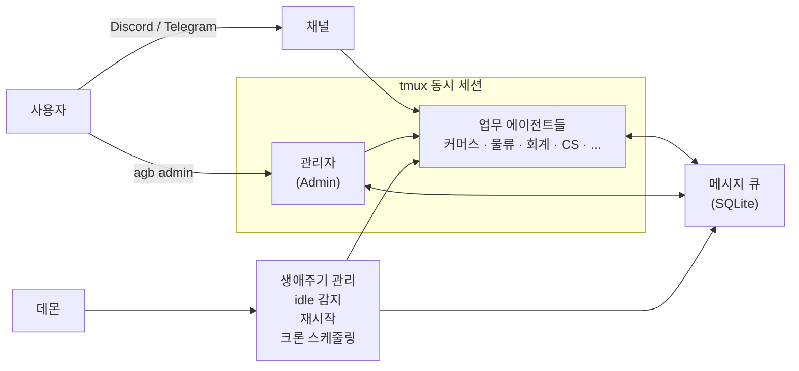

# Agent Bridge

[](https://github.com/seanssoh/agent-bridge-public/actions/workflows/ci.yml)
[](./LICENSE)

**AI 에이전트 팀을 만들어서 회사 업무를 자동화하세요.**

Agent Bridge는 Claude Code와 Codex 같은 AI 코딩 에이전트를 "직원"처럼 여러 명 동시에 띄워서, 각자 맡은 업무를 수행하게 하는 로컬 오케스트레이션 플랫폼입니다.

> 5명이 할 일을 에이전트 20명이 대신합니다.
> 설정부터 유지보수까지 전부 자연어로.

**Current stable / LTS**: v0.16.2 (2026-06-08) — the official `0.16.2` release and the designated **Long-Term Support (LTS)** version. The `v0.16.1`→`v0.16.2` wave converged: the fleet rollout (macbook / SYRS mac-mini / cm-prod Linux iso v2) came back clean with zero `v0.16.2`-caused regressions (the one transient iso-agent restart on cm-prod was a pre-existing non-`v0.16.2` port conflict that self-healed via the #69 parent-death watchdog). Headline: **stabilization patch over `0.16.1` — four robustness/perf fixes surfaced by the v0.16.1 fleet rollout (macbook / SYRS mac-mini / cm-prod), VM-verified on Linux iso v2 with the flock backend** (the path that exposed two real production bugs the macOS mkdir-backend tests could not). The four fixes: **`agb status` cron cadence-health is no longer O(cron-run-records × window)** — the pure cron matcher is memoized and `last_cron_run_by_agent` reduces to the latest run per distinct `(agent, schedule)` before the cadence check, so render scales with distinct schedules not historical run rows (was ≈84s CPU on a 5,632-record host — a timeout risk for any monitor that shells `agb status`, **#1659**); **`upgrade --apply` preserves its intended exit code when stdout is closed** — a `BrokenPipeError` at a JSON emit no longer surfaces as a misleading non-zero exit (observed exit 144 on a *successful* migration), via a `emit_json(payload, rc)` helper that flushes in `try`, redirects to devnull on broken pipe, and returns the intended rc (no global SIGPIPE handler, **#1660**); **`agb upgrade`/`rollback` now hold a singleton lock** — a new shared `lib/bridge-lock.sh` (flock-first, `mkdir` fallback) acquires `state/locks/upgrade.lock` for the mutating paths, so a second concurrent run **refuses fast** with `already running (pid …, started …)` and a non-zero rc (opt-in bounded `--wait`), also fixing two Linux-only bugs that made the lock non-functional on every flock host (`flock -w 0` is rejected by real `flock(1)` → `flock -n`; a bare `exec {fd}>>file 2>/dev/null` had permanently muted stderr, **#1661**); and **an upgrade-conflict sidecar can no longer cascade-fail iso agent launches** — the iso plugin-cache build now pattern-skips upgrade/VCS sidecars (`*.upgrade-conflict`, `*.orig`, `*.rej`, merge-tool sidecars, `.git/.hg/.svn`) and per-entry guards an unreadable file with a warning instead of aborting the whole cache, while *required* plugin-contract material (`plugin.json`, `server.ts`/`server.js`, `package.json`, `mcp.json`) now fails loud rather than silently shipping a broken plugin (was a real cm-prod iso v2 outage, **#1663**). Each PR codex pair-reviewed (per-PR + a full-branch integration review); the integration branch was Linux iso v2 VM-verified on the flock backend. Same `agb upgrade` path; wire protocol `a2a-enqueue-v1` unchanged. The `v0.16.1` headline (an A2A audit follow-up, iso-upgrade robustness #1635/#1636, MS365 `get_valid_token` #1650, and a complete `set -u` hardening of the roster-map accessors #1627) and earlier `v0.16.0` / `v0.15.x` headlines carry forward. See [CHANGELOG.md](./CHANGELOG.md#0162--2026-06-08) for the full list.

**Previous stable**: v0.16.1 (2026-06-08) — superseded by `v0.16.2`; the official `0.16.1` release. Headline: **stabilization + hardening over `0.16.0` — an A2A audit follow-up, iso-upgrade robustness (#1635 backup-scan graceful-skip, #1636 `_template` workdir scaffolding), an MS365 cross-plugin token-refresh (`get_valid_token` #1650), and a complete `set -u` hardening of the roster-map accessors (#1627)** — plus a post-restart auto-wake (#1639), a unified deferred-notification staleness gate (#1619), and settings.json cosmetic-diff conflict suppression (#1638). Linux-VM verified on iso v2. The earlier `v0.16.0` headline (A2A rooms whole-room fan-out #1594 + Cloudflare One/WARP-Mesh transport #1595 + bounded AskUserQuestion #1569, on the rc1-rc3 foundation) and the `v0.15.x` headlines carry forward. See [CHANGELOG.md](./CHANGELOG.md#0161--2026-06-08) for the full list.
- **Recommended upgrade target.** `v0.16.2` (current stable) supersedes `v0.16.1` / `v0.16.0` / `v0.15.4` / `v0.15.3` / `v0.15.2` / `v0.15.1` / `v0.15.0`, all the `v0.16.0-rc1..rc3` / `v0.15.0-rc1` / `v0.15.0-betaN` / `v0.14.5-betaN` prereleases — treat the latest stable tag as current for production. The `v0.16.0-rc1..rc3` candidates are folded into the `v0.16.0`→`v0.16.1`→`v0.16.2` stable line.
- v0.7.x → v0.16.2 leap path: **direct `agent-bridge upgrade --apply` to `v0.16.2`** is the current recommended (stable) path — the v0.13.7-v0.13.10 cycle fixed the Bash 5.3.9 heredoc-stdin deadlock chain by extracting leap-path bodies to `lib/upgrade-helpers/`, so the leap is single-atomic from any v0.7.x/v0.8.x/v0.9.x/v0.10.x/v0.11.x/v0.12.x/v0.13.x/v0.14.x/v0.15.x/v0.16.x source. v0.13.10 is the minimum-safe fallback if you're pinned below v0.14.x or troubleshooting an in-flight leap. See [OPERATIONS.md §"Upgrade"](./OPERATIONS.md#upgrade) for recipe + follow-up notes.
  - **A2A cross-bridge hosts, pre-v0.16.1 source (#1685):** the *first* upgrade to a v0.16.x target from a pre-v0.16.1 source (v0.15.x / v0.16.0 / rc) is run by the old upgrader, which does not restart the A2A receiver (`bridge-handoffd.py`), so it would keep running stale receiver code (e.g. the pre-#1623 backpressure that silently 429s inbound peers). The destination daemon self-heals this on its next tick (one guarded, preflight-gated restart); on a host whose always-on daemon is not running, restart once by hand: `bash <BRIDGE_HOME>/bridge-handoff-daemon.sh restart` (then `agb a2a daemon healthz` → healthy). Automatic from **v0.16.1+ → v0.16.x** onward. Non-A2A hosts are unaffected.
- macOS: works in shared-mode (default). Linux-user isolation is Linux-only — v0.14.0's platform discriminator + v0.14.1's primitives-readiness check make the gate explicit (`BRIDGE_ISOLATION_REQUIRED=auto|yes|no`).
- Stabilization roadmap: [`docs/stabilization-plan-2026-05-15.md`](./docs/stabilization-plan-2026-05-15.md). the 0.14.x/0.15.0 line cleared S0–S3 + S5 Track A + parts of S7 (footgun #11 ratchet, daemon-hang hardening); S4 (Bash 3.2 cleanup), S5 B/C/D, S6, S8–S10 remain.

---

## 실제 사용 사례

D2C 브랜드를 운영하는 1인 스타트업이 Agent Bridge로 20개 이상의 에이전트를 운영하고 있습니다:

- **커머스 에이전트** — Shopify 주문 처리, 재고 관리, 테마 배포
- **물류 에이전트** — 3PL 창고 배송 추적, 포장 지시, 주문 상태 모니터링
- **회계 에이전트** — 회계 시스템 연동, 거래 분류, 세금계산서 관리
- **광고 에이전트** — Facebook/Instagram 광고 성과 모니터링, 예산 추적
- **CS 에이전트** — 고객 문의 응대, 리뷰 모니터링
- **마케팅 에이전트** — 리뷰 분석, 인플루언서 시딩 관리
- **비서 에이전트** — 대표의 일정, 이메일, 브리핑, 저녁 다이제스트
- **관리자 에이전트** — 시스템 전체를 관리하는 주치의

각 에이전트는 Discord 채널에 상주하며, 담당자가 채널에 말을 걸면 응답합니다. 에이전트끼리 일감을 주고받고, 문제가 생기면 사람에게 보고합니다.

**이 모든 것이 Mac mini 한 대에서 돌아갑니다.(리눅스 클라우드 서버에서도 가능)**

---

## 한눈에 보기



---

## 이 프로젝트가 풀고자 하는 문제

### 최소 인력으로 운영되는 AI 네이티브 조직

스타트업과 같은 소규모 팀이 마케팅, CS, 물류, 회계, 개발을 한두 명이 다 맡고 있다면 — 각 영역에 전문 AI 에이전트를 배치해서 사람은 의사결정에 집중할 수 있습니다.

### 구체적으로 이런 것이 가능합니다

- **24시간 고객 응대** — Discord/Telegram에 에이전트가 상주하며 고객 문의를 즉시 처리
- **자동 업무 체인** — 주문이 들어오면 Shopify 에이전트가 확인 → 물류 에이전트가 출고 지시 → 완료되면 CS 에이전트가 배송 안내
- **정기 보고** — 매일 아침 브리핑, 매주 매출 분석, 매월 결산을 크론으로 자동 생성
- **에이전트 간 협업** — 광고팀 에이전트가 "이번 주 광고비가 예산 초과"라고 보고하면 회계 에이전트가 확인하고 사람에게 알림
- **자연어 유지보수** — "커머스 에이전트한테 매일 아침 9시에 재고 리포트 보내게 해줘" → 관리자 에이전트가 크론 설정까지 처리

---

## 설계 철학

Agent Bridge는 **가능한 한 적게 만들고, 빨리 사라지는 것**이 목표입니다.

Anthropic과 OpenAI는 빠른 속도로 자사 에이전트 하네스에 기능을 추가하고 있습니다. 멀티에이전트 오케스트레이션, 메모리, 도구 연동 같은 기능이 결국 Claude Code와 Codex에 네이티브로 들어올 것입니다.

그때까지 필요한 최소한의 접착제 — 그것이 Agent Bridge입니다.

- **자체 에이전트 런타임을 만들지 않습니다.** Claude Code와 Codex가 에이전트 그 자체입니다.
- **모델 제작사의 로드맵을 따릅니다.** 자체 구현보다 업스트림 기능을 우선 사용합니다.
- **궁극적으로는 흡수될 것을 전제합니다.** Agent Bridge가 필요 없어지는 날이 오면, 그것이 성공입니다.

---

## 공통 운영 계약

bridge가 관리하는 에이전트는 공통 문서를 자동으로 공유합니다.

- `~/.agent-bridge/shared/COMMON-INSTRUCTIONS.md`
  - 전 에이전트 공통 운영 규칙 SSOT
- `~/.agent-bridge/shared/CHANGE-POLICY.md`
  - 기술 변경의 upstream/downstream 분류 기준
- `~/.agent-bridge/shared/TOOLS.md`
  - queue, cron, memory, handoff 명령 reference
- `~/.agent-bridge/shared/SKILLS.md`
  - 공용 skill catalog

새 에이전트를 만들면 이 문서들이 자동으로 링크됩니다. 공통 규칙을 바꾸고 싶으면 각 에이전트의 `CLAUDE.md`를 20개 수정하는 대신 shared 문서를 갱신하면 됩니다.

shared 문서는 `agb upgrade` 때 통째로 재생성되므로 `COMMON-INSTRUCTIONS.md`를 직접 편집하면 업그레이드에서 사라집니다. 한 설치에만 적용할 공통 규칙은 `~/.agent-bridge/shared/COMMON-INSTRUCTIONS.local.md`에 둡니다. 이 파일이 있으면 그 내용이 생성된 `COMMON-INSTRUCTIONS.md` 끝에 명시적 마커와 함께 덧붙고, 업그레이드가 이 override 파일을 덮어쓰지 않습니다. 파일이 없으면 출력은 종전과 동일합니다.

대시보드 Discord 알림은 전체 에이전트 목록을 매번 뿌리는 대신, roster 기준 상태 변화와 주기적 요약만 간결하게 보냅니다.

---

## 시작하기

### 필요한 것

- macOS 또는 Linux (Ubuntu / Debian / Oracle Linux 등 systemd 기반)
- `git`, `python3`, `tmux`
- **Bash 4+** (macOS 는 system Bash 3.2 라서 `brew install bash` 후 PATH 우선 설정)
- [Claude Code](https://docs.claude.com/en/docs/claude-code) 설치 (메인 에이전트 엔진)
- 선택: [Codex CLI](https://github.com/openai/codex) (admin 의 codex pair `<admin>-dev` 와 codex review workflow 용 — 없어도 admin 운영 가능)

Claude Code를 메인으로 사용하는 이유: Discord/Telegram 등 외부 채널 연결을 네이티브 플러그인으로 지원하기 때문입니다. Codex도 에이전트 엔진으로 완전히 지원하지만, 채널 연동이 필요한 에이전트에는 Claude Code를 사용합니다.

> **플랫폼 지원 범위**: macOS는 개발자용입니다. 멀티 테넌트 격리(`BRIDGE_AGENT_ISOLATION_MODE=linux-user`)는 Linux에서만 동작합니다. macOS는 기본 `shared` 모드 + hook 계층 격리(tool policy, prompt guard)까지만 지원합니다. 자세한 지원 매트릭스는 [docs/platform-support.md](./docs/platform-support.md)를 참고하세요.

> **v0.14.1 clean-install 동작 (참고)**: codex 부재 시 bootstrap 이 자동으로 `<admin>-dev` pair + picker-sweep cron 생성을 skip 합니다 (crash-loop 없음). `agb admin` 첫 호출이 자동으로 onboarding nudge 를 보내 admin 에이전트가 2 가지 질문 (이름·채널) 부터 시작합니다. Linux 신규 install 에서 `ab-shared` 그룹이 아직 만들어지기 전에는 v2 enforcement 도 자동 skip — `[경고] ensure_matrix_path failed` 노이즈 없음. 자세한 운영자 follow-up: [OPERATIONS.md §"v0.14.1 completeness pass"](./OPERATIONS.md#v0141-completeness-pass-2026-05-16--operator-follow-up).

### 설치

Claude Code에게 맡기세요.

```bash
claude
```

Claude Code가 열리면 이렇게 말합니다:

```text
https://raw.githubusercontent.com/seanssoh/agent-bridge-public/main/README.md 를 읽고 Agent Bridge를 설치해줘.
CLAUDE_INSTALLER_STEPS 블록을 찾아서 그 단계만 그대로 실행해.
저장소 구조를 추측해서 설치하지 말고, README에 설치 단계가 없다고 판단하지 마.
```

<!-- CLAUDE_INSTALLER_STEPS_BEGIN -->
<details>
<summary>Claude Code installer instructions</summary>

You are installing Agent Bridge for a non-technical user. Follow these steps exactly unless the user explicitly asks for a different install path.
If you think this README has no concrete install steps, stop and reread this `CLAUDE_INSTALLER_STEPS` block. Do not infer an install flow from repository structure.

1. Verify prerequisites.
   - `git --version`
   - `python3 --version`
   - `tmux -V`
   - `claude --version`
   - On macOS, if `/opt/homebrew/bin/bash` exists, prefer it. If not, warn the user that macOS system Bash 3.2 may be unsupported and ask them to install Homebrew Bash if the scripts fail.

2. Clone or update the public source checkout, then pin it to the latest stable release tag.
   Keep the source checkout hidden at `~/.agent-bridge-source`. If an older visible checkout exists at `~/agent-bridge-public`, move it automatically only when it is clean and points to this public repository. If you intentionally keep the source checkout elsewhere, such as `~/Projects/agent-bridge-public`, set `AGENT_BRIDGE_SOURCE_DIR` or pass `agent-bridge upgrade --source /path/to/agent-bridge-public` when upgrading from the live install.

   ```bash
   REPO_URL="https://github.com/seanssoh/agent-bridge-public"
   SOURCE_DIR="${AGENT_BRIDGE_SOURCE_DIR:-$HOME/.agent-bridge-source}"
   LEGACY_SOURCE_DIR="$HOME/agent-bridge-public"

   if [ -e "$SOURCE_DIR" ] && [ ! -d "$SOURCE_DIR/.git" ]; then
     echo "ERROR: $SOURCE_DIR exists but is not a git checkout. Move it aside and retry." >&2
     exit 1
   fi

   if [ ! -d "$SOURCE_DIR/.git" ] && [ -d "$LEGACY_SOURCE_DIR/.git" ]; then
     legacy_origin="$(git -C "$LEGACY_SOURCE_DIR" remote get-url origin 2>/dev/null || true)"
     # Match BOTH the historical `SYRS-AI/...` origin (existing checkouts still
     # point there after the repo transfer) and the current `seanssoh/...` so
     # the relocate works either way. Do NOT narrow this to seanssoh-only — that
     # would skip migrating the very SYRS-AI checkouts this transition targets.
     if printf '%s\n' "$legacy_origin" | grep -qE '(SYRS-AI|seanssoh)/agent-bridge-public'; then
       if git -C "$LEGACY_SOURCE_DIR" diff --quiet && git -C "$LEGACY_SOURCE_DIR" diff --cached --quiet; then
         mv "$LEGACY_SOURCE_DIR" "$SOURCE_DIR"
       else
         echo "Keeping $LEGACY_SOURCE_DIR because it has local changes; cloning a clean hidden source checkout." >&2
       fi
     fi
   fi

   if [ -d "$SOURCE_DIR/.git" ]; then
     git -C "$SOURCE_DIR" fetch --tags --prune origin
   else
     git clone "$REPO_URL" "$SOURCE_DIR"
     git -C "$SOURCE_DIR" fetch --tags --prune origin
   fi

   LATEST_TAG="$(
     git -C "$SOURCE_DIR" tag --list 'v[0-9]*.[0-9]*.[0-9]*' |
     python3 -c 'import re,sys
tags=[x.strip() for x in sys.stdin if re.fullmatch(r"v\d+\.\d+\.\d+", x.strip())]
tags.sort(key=lambda t: tuple(map(int, t[1:].split("."))))
print(tags[-1] if tags else "")'
   )"
   if [ -z "$LATEST_TAG" ]; then
     echo "ERROR: no stable Agent Bridge release tag found in $SOURCE_DIR." >&2
     exit 1
   fi
   git -C "$SOURCE_DIR" checkout --detach "$LATEST_TAG"
   ```

   If your shell rc sources the source checkout directly rather than `~/.agent-bridge`, rerun `bash scripts/install-shell-integration.sh --shell zsh --apply` or the matching bash variant after moving the checkout so the managed block points at the new path.

3. Deploy tracked source files into the live install at `~/.agent-bridge`.
   Runtime files, agent homes, queue state, logs, backups, and local roster files must be preserved.

   ```bash
   SOURCE_DIR="${AGENT_BRIDGE_SOURCE_DIR:-$HOME/.agent-bridge-source}"
   cd "$SOURCE_DIR"
   bash scripts/deploy-live-install.sh --target "$HOME/.agent-bridge" --restart-daemon
   ```

4. Bootstrap the live install.
   Use Claude Code as the default admin engine. The default admin role is `patch`.

   ```bash
   cd "$HOME/.agent-bridge"
   bash bridge-bootstrap.sh --admin patch --engine claude
   ```

5. Verify the install.

   ```bash
   "$HOME/.agent-bridge/agent-bridge" status
   "$HOME/.agent-bridge/agent-bridge" version
   "$HOME/.agent-bridge/agent-bridge" upgrade --check --no-restart-daemon
   ```

6. Final handoff to the user.
   Tell the user to close the temporary installer Claude session. If they do not open a fresh terminal, show the exact `rc_reload_command` printed by `bridge-bootstrap.sh` immediately before `agb admin`.

   Do not invent a generic reload command. Use the shell-specific command from the bootstrap output.

   Then run:

   ```bash
   agb admin
   ```

Do not ask the user to learn internal commands unless there is an error. If a command fails, show the failing command, summarize the cause, and continue with the safest fix.

</details>
<!-- CLAUDE_INSTALLER_STEPS_END -->

설치가 끝나면:

```bash
agb admin
```

이것만 기억하면 됩니다. 이후 모든 것은 관리자 에이전트(패치)에게 자연어로 요청하면 됩니다.

> **첫 한 시간 동안 무엇을 해야 할지 모르겠다면**: [docs/onboarding/first-install.md](./docs/onboarding/first-install.md)를 읽어주세요. 5분 요약 + 진단 흐름 + 다음 단계 (스태틱 에이전트 만들기 / 채널 붙이기 / 트러블슈팅) 분기점이 있습니다. 페르소나별 짧은 runbook 모음: [docs/onboarding/](./docs/onboarding/).

---

## Discord 연결하기

에이전트가 Discord에서 일하려면 Discord 봇이 필요합니다. 먼저 관리자 에이전트인 패치를 Discord에 연결해봅니다.

먼저 Discord에서:

1. 좌측 하단 **User Settings**(기어 아이콘) → **Advanced** → **Developer Mode**를 켭니다.
2. 서버에 `#patch` 채널을 만듭니다.
3. 채널명에서 마우스 오른쪽 클릭 → **Copy Channel ID**로 채널 ID를 복사합니다.
   
### 1. Discord 봇 만들기

[Discord Developer Portal](https://discord.com/developers/applications)에서:

1. **New Application** → 이름 입력 (예: "Patch")
2. **General Information** → **Application ID** 복사
3. **Installation** → **Install Link**를 `None`으로 설정
4. **Bot** 탭 → Username 설정, **Public Bot** 끄기
5. **Privileged Gateway Intents** → **Message Content Intent** 켜기
6. **Reset Token** 버튼 클릭 → 토큰 복사
7. **Bot Permissions**에서 권한 선택 후 **Permissions Integer** 복사

권한은 처음에는 단순하게 `Administrator`로 시작할 수 있습니다. 운영 서버에서 최소 권한으로 줄이고 싶다면 `View Channels`, `Send Messages`, `Manage Messages`, `Embed Links`, `Attach Files`, `Read Message History`, `Add Reactions` 정도를 부여하세요.

### 2. 패치(터미널)에게 설정 맡기기

```bash
agb admin
```

```text
Discord 봇을 연결해줘.
토큰은 [복사한 토큰]이야.
Application ID는 [복사한 Application ID]야.
Permissions Integer는 [복사한 숫자]야.
패치 에이전트를 #patch 채널([복사한 채널 ID])에 연결해줘.
봇을 Discord 서버에 초대할 링크도 생성해줘.
```

관리자 에이전트가 토큰 저장, 채널 매핑, 에이전트 재시작까지 처리합니다.
서버 초대용 링크를 눌러 Discord 서버에 봇을 넣어주면 연결이 끝납니다.

### 지원 채널

| 채널 | 상태 | 권장 |
|------|------|------|
| **Discord** | 완전 지원 | **메인으로 권장** — 채널별 에이전트 분리, 팀 협업에 최적 |
| **Telegram** | 완전 지원 | 개인 비서 용도에 적합 |
| **Microsoft Teams** | Phase 1 지원 | 기업 Teams 환경용 — Azure Bot webhook 기반, `reply`/`fetch_messages` 지원 |

Discord를 메인으로 추천하는 이유: 서버 내 채널별로 에이전트를 배치할 수 있어서 팀 운영에 자연스럽습니다.

### Microsoft Teams 연결하기

Teams 채널은 Claude Code Channels 플러그인(`plugin:teams@agent-bridge`)으로 동작합니다. 현재 범위는 Phase 1입니다: Azure Bot Service webhook 수신, allowlist 접근 제어, Claude 채널 알림, `reply`, `fetch_messages` 도구를 지원합니다.

필요한 것:

- Azure Bot Resource의 Application ID
- Azure Bot client secret
- Tenant ID
- HTTPS로 외부에서 접근 가능한 messaging endpoint (`https://<domain>/api/messages`)
- `bun` 실행 파일 (Teams 플러그인 런타임)

관리자 에이전트에게 자연어로 맡길 수 있습니다:

```text
patch 에이전트를 Microsoft Teams에 연결해줘.
Azure Bot Application ID는 [app id]야.
client secret은 [secret]이야.
Tenant ID는 [tenant id]야.
허용할 Teams 사용자 ID 또는 AAD object ID는 [user id]야.
```

직접 실행할 때는 production bring-up 명령을 권장합니다 (messaging endpoint + webhook ingress 까지 포함). client secret은 셸 히스토리·프로세스 argv 노출을 피하려고 `BRIDGE_TEAMS_APP_PASSWORD` 환경변수(또는 `--app-password-file <path>`)로 전달합니다:

```bash
export BRIDGE_TEAMS_APP_PASSWORD='<client-secret>'
agb setup teams patch \
  --app-id "<azure-bot-app-id>" \
  --tenant-id "<tenant-id>" \
  --allow-from "<aad-object-id-or-teams-user-id>" \
  --messaging-endpoint "https://<your-domain>/api/messages" \
  --webhook-host "0.0.0.0" \
  --webhook-port 3978 \
  --ingress-port 80 \
  --yes
```

설정 후 `agb agent restart patch` 로 에이전트 재시작 → ingress webhook 으로 Azure Bot 이 메시지 전달 → Claude session 이 응답. (로컬 reverse proxy 뒤에 두는 환경이면 `--webhook-host 127.0.0.1 --ingress-port <proxy-upstream-port>` 로 변경) 팀 채널에서 멘션이 있을 때만 깨우려면 `--conversation` + `--require-mention` 추가:

```bash
agb setup teams patch \
  --conversation "<teams-conversation-or-channel-id>" \
  --require-mention
```

자세한 production setup procedure (Azure Bot 등록, HTTPS endpoint, allowlist, troubleshooting) 는 [docs/channels/teams-setup.md](./docs/channels/teams-setup.md) 를 참고하세요. 플러그인 동작은 [plugins/teams/README.md](./plugins/teams/README.md).

### 채널 MCP 연결 오류가 날 때

Claude Code 채널 플러그인은 설치만으로는 준비되지 않습니다. Discord/Telegram 봇 토큰 또는 Teams Azure Bot credential, 접근 설정 파일, 그리고 Claude Code 플러그인이 모두 준비되어야 MCP 서버가 연결됩니다. Agent Bridge는 `setup`과 에이전트 시작 시점에 필요한 Claude Code 플러그인을 자동으로 설치/활성화합니다.

일부 환경에서는 Claude Code의 `claude-plugins-official` 로컬 marketplace mirror가 오래되어 `discord@claude-plugins-official` 또는 `telegram@claude-plugins-official` 설치가 실패할 수 있습니다. Agent Bridge는 이 경우 marketplace를 `remove` 후 `add anthropics/claude-plugins-official`로 강제 갱신하고 1회 재시도합니다.

Agent Bridge는 각 에이전트별 state dir을 사용합니다:

```text
~/.agent-bridge/agents/<agent>/.discord/.env
~/.agent-bridge/agents/<agent>/.discord/access.json
~/.agent-bridge/agents/<agent>/.telegram/.env
~/.agent-bridge/agents/<agent>/.telegram/access.json
~/.agent-bridge/agents/<agent>/.teams/.env
~/.agent-bridge/agents/<agent>/.teams/access.json
```

에이전트에 채널이 지정돼 있는데 토큰이나 access 파일이 없으면 `agb agent start <agent>`는 불완전한 `--channels` 세션을 띄우지 않고 어떤 setup 명령을 실행해야 하는지 출력합니다. 첫 admin 온보딩 중에는 사용자가 설정을 마칠 수 있도록 준비된 채널만 붙이고, 아직 준비 안 된 채널은 임시로 제외합니다.

자동 복구 후에도 실패했을 때 수동으로 확인하려면:

```bash
claude plugin marketplace remove claude-plugins-official
claude plugin marketplace add anthropics/claude-plugins-official
claude plugin install --scope user discord@claude-plugins-official
claude plugin enable --scope user discord@claude-plugins-official
claude plugin install --scope user telegram@claude-plugins-official
claude plugin enable --scope user telegram@claude-plugins-official
```

직접 설정해야 할 때는:

```bash
agb setup discord <agent> --token <DISCORD_BOT_TOKEN> --channel <DISCORD_CHANNEL_ID>
agb setup telegram <agent> --token <TELEGRAM_BOT_TOKEN> --allow-from <TELEGRAM_USER_ID> --default-chat <TELEGRAM_CHAT_ID>
BRIDGE_TEAMS_APP_PASSWORD=<TEAMS_APP_PASSWORD> agb setup teams <agent> --app-id <TEAMS_APP_ID> --tenant-id <TEAMS_TENANT_ID> --allow-from <TEAMS_USER_ID>
```

참고: `claude mcp list`를 Agent Bridge 밖에서 실행하면 Claude Code의 기본 전역 경로(`~/.claude/channels/...`)를 기준으로 실패가 보일 수 있습니다. Agent Bridge가 실제로 쓰는 기준은 위의 에이전트별 state dir입니다. 검증은 `agb agent show <agent>`에서 `channel_diagnostics`를 보거나, `agb agent start <agent> --dry-run`, `agb status`로 확인하세요.

---

## 에이전트 종류

### 스태틱 에이전트 (Static)

Discord에 상주하며 영속적 메모리를 가지고 지속 근무하는 에이전트입니다. 패치에게 요청해서 만듭니다.

```text
"물류 담당 에이전트를 만들어줘. 이름은 warehouse, Discord #warehouse 채널에 연결해줘."
```

스태틱 에이전트에는 두 가지 모드가 있습니다:

#### Always-On (상시 가동)

세션이 항상 떠있습니다. 메시지에 즉시 응답하고 부팅 대기 시간이 없습니다.

- **장점**: 응답 지연 0초, 대화 컨텍스트 유지
- **단점**: 메모리를 항상 점유
- **용도**: 고객 응대(CS), 개인 비서 등 즉시 응답이 중요한 역할

#### Timeout (유휴 시 자동 종료)

일정 시간 idle 상태면 자동으로 세션이 내려갑니다. 새 메시지가 오면 자동으로 다시 올라옵니다.

- **장점**: 메모리 절약 (Mac mini 8GB 같은 환경에서 필수)
- **단점**: 첫 응답에 10~20초 부팅 시간
- **용도**: 회계, 분석, 모니터링 등 항상 즉시 응답하지 않아도 되는 역할

> **참고**: 제작자의 환경(Mac mini 8GB)에서는 20개 이상의 에이전트를 돌리기 위해 대부분을 timeout 모드로 운영합니다. 메모리가 넉넉하다면 전부 always-on으로 돌려도 됩니다 — 부팅 시간 없이 더 쾌적합니다.

### 다이나믹 에이전트 (Dynamic)

사용자가 직접 만들어서 쓰고 닫을 수 있는 인스턴트 에이전트입니다. 기존 Claude Code나 Codex 사용 경험을 생각하면 됩니다.

```bash
# Claude Code 기반 다이나믹 에이전트 (현재 디렉토리가 cwd)
agb --claude --name my-worker

# Codex 기반 다이나믹 에이전트
agb --codex --name my-coder

# --loop: crash/종료 시 5초 내 자동 재시작 (영속 세션)
agb --claude --name my-worker --loop

# --loop 없음: 한 번 실행 후 종료
agb --claude --name one-shot-task

# --prefer: 다른 worktree/세션 선호 (shared repo 에서 격리된 git worktree)
agb --claude --name pr-fix --prefer new      # 항상 새 git worktree
agb --claude --name pr-fix --prefer wake     # 깨어있는 기존 세션이 있으면 attach
agb --claude --name pr-fix --prefer shared   # primary checkout 강제 (reducer 우회)
```

**--loop의 차이**:
- `--loop` 있음: 백그라운드에서 에이전트가 crash하거나 종료되면 **5초 내 자동 재시작**. 스태틱 에이전트와 동일한 영속 운영 모드. 장시간 작업하면서 세션이 끊겨도 자동 복구되어야 할 때.
- `--loop` 없음: 주어진 작업만 하고 세션 종료. 일회성 작업에 적합.

**--prefer 의 차이** (기본값은 매칭되는 정적 role 유무에 따라 reducer 가 자동 선택. TTY 면 prompt, non-TTY 면 `shared` — `--name <new>` 가 동명 정적 role 을 silent 하게 깨우지 않도록 wake 는 명시적 `--prefer wake` opt-in 만 허용. 자세한 배경은 issue #4813):
- `--prefer shared`: 현재 셸 cwd 그대로 사용. 가장 단순. primary checkout 을 강제하려면 명시.
- `--prefer wake`: 같은 이름의 idle 세션이 있으면 깨워서 재사용. 새 세션 spawn 비용 절약.
- `--prefer new`: 매 호출마다 새 git worktree 생성. shared repo 에서 병렬 fixer 운영 시 conflict 방지 (예: 멀티-PR review 동시 진행).

> 참고: 첫 admin 온보딩이 아직 끝나지 않은 상태에서는 `exit`로 정상 종료하면 자동 재시작하지 않습니다. 온보딩 완료 후에는 `exit`로 Claude가 종료돼도 tmux client만 분리되고 에이전트 루프는 백그라운드에서 계속 재시작합니다. 강제로 내리려면 바깥 쉘에서 `agb kill <agent>`를 사용합니다.

> 참고: 스태틱 에이전트는 기본적으로 `--loop`이 켜져 있습니다. 백그라운드 crash는 5초 후 자동 재시작되며, 10회 연속 실패 시에는 60초 대기 후 재시도합니다.

### Admin codex pair (`<admin>-dev`) — server 자동 등록 / dev 명시 등록 contract

권장 admin 페어는 모델 다양성을 보장하는 `patch (claude) + patch-dev (codex)` 조합입니다. issue #1052 (reconsiders #4769) 부터 `<admin>-dev` 자동 등록은 **두 조건이 모두 충족될 때만** 설치 시점에 일어납니다:

- **host profile = `server` 이고 codex CLI 가 설치돼 있을 때** → `bridge-bootstrap.sh` / `agent-bridge init` 이 admin claude 에이전트와 함께 `<admin>-dev` (codex) 를 자동 생성·활성화합니다. 별도 명령이 필요 없습니다.
- **host profile = `dev` 일 때** → codex CLI 가 있어도 `<admin>-dev` 는 자동 생성되지 않습니다 (dev 프로파일은 의도적으로 admin 1 개만 등록). 필요하면 아래 명령으로 직접 등록합니다.
- **codex CLI 가 없을 때** → 페어 프로그래밍은 사용할 수 없고 claude admin 만 단독 실행됩니다.

`dev` 호스트에서, 또는 codex CLI 를 나중에 설치한 server 호스트에서 페어를 수동으로 등록하려면:

```bash
agent-bridge setup admin patch                          # BRIDGE_ADMIN_AGENT_ID 저장
agent-bridge agent create patch-dev --engine codex \
  --workdir "$(agent-bridge agent show patch --field workdir)" \
  --allow-shared-workdir --always-on                    # pair 등록
```

pair-programming SOP — admin 이 plan, dev 가 review/implement — 는 페어가 등록된 호스트에서 운영자가 admin 의 `CLAUDE.md` 에 직접 작성해 사용합니다. picker-sweep cron 은 `<admin>-dev` 가 roster 에 등록된 상태에서 등록되며, server + codex 자동 등록 경로에서는 같은 init 실행 안에서 backfill 됩니다 (codex CLI 를 나중에 설치한 server 호스트는 `bridge-bootstrap.sh` 재실행 시 페어 + cron 모두 backfill).

**다이나믹 에이전트는 이런 때 씁니다**:
- 잠깐 작업하고 버릴 워커가 필요할 때 (크론/서브에이전트와 달리 사용자가 실시간으로 조종 가능)
- 서브 프로젝트를 별도 폴더에서 진행하면서 기존 에이전트들과 소통이 필요할 때
- 특정 코드베이스를 탐색하거나 실험할 때

---

## 핵심 구조

### 메시지 큐

에이전트들은 SQLite 기반 task queue를 통해 일감을 주고받습니다.

- **일반 작업**: 큐에 넣으면 상대 에이전트가 여유 있을 때 처리
- **긴급 작업**: 즉시 인터럽트 — 상대 에이전트의 현재 작업을 중단시키고 처리
- **핸드오프**: 작업을 다른 에이전트에게 넘김
- 세션이 꺼졌다 켜져도 상태 유지

### 팀 지식 SSOT

팀 전체가 공유해야 하는 사람, 에이전트 역할, 운영 규칙, 도구, 데이터 소스, 결정, 프로젝트, 플레이북은 `shared/wiki/`에 둡니다.

- **Markdown wiki**: 사람이 읽고 에이전트가 관리하는 팀 지식의 원본
- **PostgreSQL/외부 DB**: 고객, 주문, 광고, 재고 같은 정형 데이터의 원본
- **SQLite/FTS/vector**: 검색을 빠르게 하기 위한 재생성 가능한 인덱스
- **raw captures**: 채널 메시지나 크론 결과 같은 원천 기록, curated memory가 아님

```bash
agb knowledge init
agb knowledge operator set --user owner --name "Sean" --decision-scope "Final release approval"
agb knowledge search --query "primary operator"
agb knowledge lint --stale-days 90
```

- `agb knowledge lint`는 shared wiki의 broken link, orphan page, duplicate title, stale page를 점검합니다.
- 에이전트별 memory hygiene 점검은 `bash ~/.agent-bridge/scripts/memory-enforce.sh --notify --json`로 수행하고, 필요하면 cron payload로 등록할 수 있습니다.

### 리뷰 게이트

릴리즈, 업그레이드, 위험한 코드 변경처럼 한 번 더 확인이 필요한 작업은 task queue로 리뷰를 요청할 수 있습니다. 리뷰 정책은 선택 사항이며 `review-policy.json`으로 agent별 또는 command family별 reviewer, priority, bypass 사유를 지정합니다.

```bash
agb review policy --agent patch --family release
agb review request --subject "release 0.1.0" --reviewer reviewer --body-file /tmp/release-plan.md
agb review complete <task-id> --reviewer reviewer --decision approved --note "No blockers."
```

### 데몬

백그라운드에서 항상 돌면서 전체 시스템을 관리합니다:

- **에이전트 생애주기**: idle 감지, 자동 종료, 자동 재시작
- **메시지 라우팅**: 큐에 들어온 작업을 해당 에이전트에게 전달
- **크론 스케줄링**: 매일 아침 브리핑, 주간 리포트 같은 반복 작업 실행
- **상태 모니터링**: 에이전트 health check, stale 감지, 알림

### 상태 대시보드

```bash
agb status
```

모든 에이전트의 현재 상태, 큐 적체, idle 시간, 채널 연결 상태를 한눈에 보여줍니다.

### 복원력 마커

데몬은 에이전트가 살아 있는지와 별개로 여러 복원력 상태를 marker로 추적합니다. stall, crash-loop, 채널 health, context pressure는 서로 다른 상태로 기록됩니다. stall/crash-loop/channel health는 정책에 따라 admin 큐나 외부 채널로 에스컬레이션될 수 있지만, context pressure는 감사 로그와 상태 파일만 남깁니다.

특히 context pressure는 프로세스 장애가 아닙니다. 세션이 정상 실행 중이어도 대화가 길어져 compaction이 가까워진 상태를 별도로 표시합니다. 자동 대응은 setup-time Claude Code native auto-compact 설정(#473) 쪽에서 처리하고, daemon은 `[context-pressure]` admin task나 `[admin-compact]` queue chain을 만들지 않습니다.

### MCP 고아 프로세스 정리

Claude Code가 띄운 MCP 서버는 tmux 세션 종료 후에도 orphan으로 남을 수 있습니다. 데몬은 기본 5분 간격으로 보수적인 MCP 패턴을 스캔하고, 즉시 부모가 init/launchd로 떨어진 orphan MCP 프로세스만 정리합니다.

- 세션 종료 시점에는 `BRIDGE_MCP_ORPHAN_SESSION_STOP_MIN_AGE_SECONDS=0` 기준으로 즉시 정리합니다.
- 주기 정리는 `BRIDGE_MCP_ORPHAN_CLEANUP_INTERVAL_SECONDS=300`, 최소 age는 `BRIDGE_MCP_ORPHAN_MIN_AGE_SECONDS=300`이 기본입니다.
- 대량 정리 기준은 `BRIDGE_MCP_ORPHAN_NOTIFY_THRESHOLD=10`이며 admin 채널로 알립니다.
- 끄려면 `BRIDGE_MCP_ORPHAN_CLEANUP_ENABLED=0`을 설정합니다.

---

## 명령어 요약

대부분의 작업은 `agb admin`에서 자연어로 처리합니다. 직접 사용할 수도 있는 주요 명령:

### 사용자가 자주 쓰는 것

| 명령 | 설명 |
|------|------|
| `agb admin` | 관리자 에이전트(패치)에 접속 |
| `agb status` | 전체 상태 대시보드 |
| `agb version` | 설치된 Agent Bridge 버전 확인 |
| `agb attach <name>` | 특정 에이전트 세션에 직접 접속 |
| `agb --claude --name <name>` | Claude Code 다이나믹 에이전트 생성 |
| `agb --codex --name <name>` | Codex 다이나믹 에이전트 생성 |
| `agb upgrade --check` | 최신 안정 릴리즈 여부 확인 |
| `agb upgrade` | 최신 안정 릴리즈로 업그레이드 |

데몬은 기본적으로 하루에 한 번 최신 stable GitHub release를 확인합니다. 새 stable 버전이 나오면 관리자 에이전트에게 `[release] Agent Bridge ... available` task를 생성하고, release notes와 이 서버에서 바로 `agb upgrade` 가능한지까지 함께 전달합니다.

또한 데몬은 기본적으로 매일 한 번 live install 백업을 `${BRIDGE_DAILY_BACKUP_DIR:-$BRIDGE_HOME/backups/daily}`에 `agent-bridge-YYYY-MM-DD.tgz` 형태로 생성합니다. 기본 스케줄은 로컬 시간 `04:00`, 기본 보존 기간은 30일이며 `logs/`, daily backup 디렉터리 자체, `__pycache__/`는 제외됩니다. 비활성화하려면 `BRIDGE_DAILY_BACKUP_ENABLED=0`을 설정하세요.

### 관리자 에이전트가 주로 쓰는 것

| 명령 | 설명 |
|------|------|
| `agb agent create <name>` | 스태틱 에이전트 생성 |
| `agb agent show <name>` | 채널/세션/loop 진단 확인 |
| `agb agent start/stop/restart <name>` | 에이전트 시작/중지/재시작 |
| `agb task create --to <agent>` | 에이전트에게 작업 전달 |
| `agb urgent <agent> "메시지"` | 긴급 인터럽트 |
| `agb inbox <agent>` | 에이전트의 수신함 확인 |
| `agb review request ...` | 큐 기반 교차 리뷰 요청 |
| `agb review complete ...` | 리뷰 승인/변경 요청/코멘트 완료 |
| `agb cron create ...` | 반복 작업 등록 |
| `agb setup discord <agent>` | Discord 채널 연결 |
| `agb setup telegram <agent>` | Telegram 채널 연결 |
| `agb setup teams <agent>` | Microsoft Teams 채널 연결 |
| `agb user set --name "<name>"` | 에이전트별 사용자 메모리 호환용 기본 사용자 프로필 저장 |
| `agb user show` | 사용자 프로필 확인 |
| `agb knowledge init` | 팀 공통 지식 위키 생성 |
| `agb knowledge operator set --user owner --name "<name>"` | primary operator의 canonical shared profile 저장/갱신 |
| `agb knowledge operator show` | primary operator profile 확인 |
| `agb knowledge promote ...` | 팀 공통 SSOT에 durable knowledge 반영 |
| `agb knowledge search --query "..."` | 팀 공통 지식 검색 |
| `agb knowledge lint [--stale-days N]` | 팀 공통 wiki hygiene 점검 |
| `agb bundle create --to <agent> ...` | 파일/리포트가 포함된 cross-agent handoff bundle 생성 + queue task 생성 |
| `agb bundle show <bundle-id>` | handoff bundle manifest 확인 |
| `agb intake triage --capture <id> --owner <agent> --route` | raw capture를 triage/extraction 후 queue task로 라우팅 |
| `agb intake show <capture-id>` | triage/extraction 결과 확인 |
| `agb memory remember ...` | 에이전트 기억 저장 |

### 진단 / 안전 / 격리 (v0.14.x)

| 명령 | 설명 |
|------|------|
| `agb doctor --json` | 전체 install health 진단 (daemon, roster, hooks, channels) |
| `agb skills list [--agent <name>] [--json]` | shared + per-agent installed skills 확인 |
| `agb worktree list` | 활성 worktree (dynamic agents with `--prefer new`) 목록 |
| `agb worktree doctor` | 고아 worktree / git stash 충돌 점검 |
| `agb migrate isolation v2 --check` | Linux v2 격리 사전 점검 (group / chmod / chown plan) |
| `agb migrate isolation v2 --apply` | Linux v2 격리 enforcement 적용 (`ab-shared` 등 group 생성 + chgrp/setfacl) |
| `agb isolation verify --agent <name>` | 특정 에이전트의 v2 격리 contract 확인 |
| `agb upgrade conflicts list` | upgrade 시 발생한 `.upgrade-conflict` 파일 목록 |
| `agb usage alerts` | Claude/Codex 사용량 한도 도달 알림 상태 |

### A2A — 브릿지 간 작업 핸드오프 (cross-bridge)

여러 Agent Bridge install 이 Tailscale tailnet 으로 연결되어 있을 때, 한 브릿지의 에이전트가 다른 브릿지의 inbox 큐로 작업을 직접 전달합니다. 인증은 ordered-pair HMAC secret + 수신측 allowlist 이며, fire-and-forget 방식입니다 (응답은 역방향 A2A send). 전체 프로토콜/보안 모델은 [`docs/a2a-cross-bridge.md`](./docs/a2a-cross-bridge.md) 참고.

| 명령 | 설명 |
|------|------|
| `agb a2a send --peer <peer> --to <agent> --title <t> [--body ...\|--body-file ...] [--priority ...] [--dry-run]` | 다른 브릿지의 에이전트에게 작업 핸드오프 (durable outbox 에 적재) |
| `agb a2a outbox list\|retry <id>\|drop <id>\|gc` | 송신측 outbox 점검 / 재시도 / 삭제 / 정리 |
| `agb a2a inbox-dedupe list\|gc` | 수신측 dedupe 원장 점검 / 정리 (operator/debug) |
| `agb a2a peers list\|test <peer>` | 설정된 peer 목록 / 도달성 확인 |
| `agb a2a deliver` | outbox 1회 drain (송신 delivery runner) |
| `agb a2a daemon start\|stop\|restart\|status\|tick` | 수신 데몬 (`bridge-handoffd.py`) lifecycle — tailnet IP 에만 bind, 그 외엔 fail-closed |

설정 파일은 git-ignored data-only JSON `handoff.local.json` (mode 0600). 예시는 [`handoff.local.example.json`](./handoff.local.example.json) 참고.

---

## 스킬 디스커버리

- shared/runtime skill의 구조화된 기준은 `~/.agent-bridge/state/skill-registry.json`입니다.
- `~/.agent-bridge/shared/SKILLS.md`는 `BRIDGE_SKILLS_DOC_MODE=legacy-catalog`일 때만 생성되는 호환 카탈로그입니다.
- 각 에이전트의 `SKILLS.md`는 shared catalog + roster의 `BRIDGE_AGENT_SKILLS` 매핑 + local `skills/`를 합쳐 regenerate됩니다.
- `agent create`, `setup agent`, `migrate docs apply`가 이 카탈로그를 다시 동기화합니다.
- 운영자 확인: `agb skills list [--agent <name>] [--json]` 으로 per-agent installed plugin routing을 점검.
- Claude 세션은 공용 운영 인덱스 `agent-bridge-operating-manual` 스킬을 함께 받습니다.
- 다이나믹 에이전트가 `--claude` 로 띄울 때는 `.claude/skills/agent-bridge/SKILL.md` 가, `--codex` 로 띄울 때는 `.agents/skills/agent-bridge/SKILL.md` 가 현재 디렉토리에 자동 설치됩니다. bridge-managed 정적 에이전트 홈에는 runtime skills 가 통째로 동기화됩니다.

---

## 전제와 보안

- Agent Bridge는 trusted local project 전용입니다.
- 에이전트에게 현재 디렉토리 접근을 의도적으로 주는 상황을 가정합니다.
- 멀티테넌트 서버나 미승인 원격 환경을 목표로 하지 않습니다.
- `BRIDGE_PROMPT_GUARD_ENABLED=1`이면 채널 인바운드, `task create` 본문, intake triage 원문, Claude `UserPromptSubmit`, MCP 출력, bot 알림/Teams reply에 optional prompt guard가 걸립니다.
- `agb guard scan "..."`, `agb guard sanitize "..."`, `agb guard status`로 현재 guard 동작을 직접 확인할 수 있습니다.
- 정적 Claude 에이전트에는 hook-based tool policy가 자동 설치됩니다. 다른 에이전트 홈, `agent-roster.local.sh`, `state/tasks.db`에 대한 직접 접근은 Claude tool 경계에서 차단되고 `audit.jsonl`에 agent tool 사용/실패가 기록됩니다.
- 위 격리는 크로스플랫폼 hook 경계입니다. OS user 분리나 container sandbox를 대체하지는 않습니다.

**격리 모델 (v2 — Linux 전용 production 격리)**:

- macOS 는 개발자용 — 항상 `shared` 모드. hook 계층 (tool policy, prompt guard) 까지만 격리.
- Linux 는 production target — `BRIDGE_AGENT_ISOLATION_MODE=linux-user` 로 OS UID 분리 + POSIX setgid group 격리 가능.
- 격리 enforcement 는 platform discriminator (`lib/bridge-isolation-discriminator.sh`) 가 게이트. `BRIDGE_ISOLATION_REQUIRED=auto|yes|no` 환경변수로 제어:
  - `auto` (기본): Linux + v2 primitives (POSIX `ab-shared` 등 group) 가 setup 되어 있으면 enforce, 아니면 silent skip
  - `yes`: 강제 enforce (self-test 시나리오에서 chgrp/setfacl 실패까지 보고 싶을 때)
  - `no`: 강제 skip
- v0.14.1 부터 신규 Linux install 에서 `agent-bridge migrate isolation v2 --apply` 가 실행되어 v2 group 이 만들어지기 전까지는 자동으로 skip — 운영자 noise 없음.

- 보안 정책에 대한 자세한 내용은 [SECURITY.md](./SECURITY.md)를 참고하세요.

---

## 업그레이드

표준 절차는 [`UPGRADING.md`](./UPGRADING.md) 참조. 모든 install 에서 동일:

```bash
~/.agent-bridge/agent-bridge upgrade --dry-run   # preview
~/.agent-bridge/agent-bridge upgrade --apply     # apply (모든 버전 호환)
```

`--apply` 는 atomic 명령이다. daemon stop → 새 source 복사 → daemon restart → 영향받는 agent 재기동 까지 한 번에. 절대 `daemon stop` 을 분리 실행하지 말 것 (#314, #315).

`v0.16.2` (stable) 이 현재 권장 target 이다. v0.7.x / v0.8.x / v0.9.x / v0.10.x / v0.11.x / v0.12.x / v0.13.x / v0.14.x / v0.15.x / v0.16.x 어디서든 단일 `upgrade --apply` 한 번으로 `v0.16.2` 까지 올라간다 (v0.13.7-v0.13.9 가 Bash 5.3.9 heredoc-chain 을 풀어놨기 때문에 중간 hop 불필요).

자세한 release-specific 절차 + troubleshooting 은:

- [`OPERATIONS.md §"Upgrade"`](./OPERATIONS.md#upgrade) — v0.14.x / v0.13.x hotfix wave 별 operator follow-up
- [`UPGRADING.md`](./UPGRADING.md) — 사전조건 / dry-run / apply / troubleshooting / rollback
- [`OPERATOR_ACTIONS_PENDING.md`](./OPERATOR_ACTIONS_PENDING.md) — release section 별 후속 행동 catalog

`upgrade --apply` 가 자동 등록하는 `[upgrade-complete]` admin task 의 body 가 release-specific 후속 행동 (있는 경우만) 을 한 번에 가리킨다. admin agent 가 그 task 를 처리하면 끝.

### 다른 server 의 admin (patch) 한테 보낼 prompt template

queue task 또는 외부 채널로 그쪽 admin 한테 그대로 보내면 됨 (버전-중립 template):

````markdown
# [upgrade-action] agent-bridge upgrade

이 host 를 현재 권장 target (`v0.16.2` 이상) 까지 올린다. 끝나면 done note 한 줄 요약으로 보고.

## 절차

```bash
~/.agent-bridge/agent-bridge upgrade --dry-run
~/.agent-bridge/agent-bridge upgrade --apply
```

검증:
```bash
cat ~/.agent-bridge/VERSION
~/.agent-bridge/agent-bridge daemon status
~/.agent-bridge/agent-bridge status
```

`upgrade` 가 자동 등록한 `[upgrade-complete]` task body 의 `OPERATOR_ACTIONS_PENDING.md` 안내가 release-specific 후속 행동을 가리킨다 — 적용 가능한 section 만 처리. body 안 가리키는 release 면 별도 액션 없음.

## 보고

이 task done note 한 줄:
```
final_version=<version>, daemon=<healthy|issue>, operator-actions=<summary|none>, notes=<...>
```

문제 시 (`upgrade --apply` 실패, daemon 안 뜸, `.upgrade-conflict` 생성):
`agb update <task-id> --status blocked --note "<reason>"` + 외부 채널로 사람 operator 보고.

절대 `daemon stop` 분리 실행 금지 (#314, #315). `upgrade --apply` 가 atomic.

## Reference
- 표준 절차: [`UPGRADING.md`](https://github.com/seanssoh/agent-bridge-public/blob/main/UPGRADING.md)
- Release section: [`OPERATIONS.md §"Upgrade"`](https://github.com/seanssoh/agent-bridge-public/blob/main/OPERATIONS.md#upgrade)
- Latest release: https://github.com/seanssoh/agent-bridge-public/releases/latest
````

---

## 추가 문서

- [docs/onboarding/](./docs/onboarding/) — 페르소나별 짧은 runbook (first-install / create-static-agent / plugin-enabled-agent / troubleshooting-auth-and-channels)
- [UPGRADING.md](./UPGRADING.md) — 표준 업그레이드 절차 (사전조건 / dry-run / apply / troubleshooting / rollback)
- [OPERATIONS.md](./OPERATIONS.md) — 운영 가이드 + release-specific operator follow-up sections (`picker-sweep` auto-unstick utility 포함)
- [OPERATOR_ACTIONS_PENDING.md](./OPERATOR_ACTIONS_PENDING.md) — release-specific 후속 행동 catalog
- [ARCHITECTURE.md](./ARCHITECTURE.md) — 내부 아키텍처
- [RELEASE.md](./RELEASE.md) — 릴리즈와 업그레이드 정책
- [KNOWN_ISSUES.md](./KNOWN_ISSUES.md) — 알려진 이슈
- [CONTRIBUTING.md](./CONTRIBUTING.md) — 기여 가이드
- [docs/agent-runtime/admin-protocol.md](./docs/agent-runtime/admin-protocol.md) — admin agent 의 first-run onboarding / self-cleanup / upgrade protocol
- [docs/channels/teams-setup.md](./docs/channels/teams-setup.md) — Microsoft Teams 채널 production bring-up (messaging endpoint + webhook ingress)
- [docs/a2a-rooms.md](./docs/a2a-rooms.md) — A2A Rooms (beta) operator usage: `agb room` lifecycle + the internal-queue `rooms_acl` enforce migration (single-node, beta1)
- [docs/stabilization-plan-2026-05-15.md](./docs/stabilization-plan-2026-05-15.md) — v0.14.x stabilization roadmap (S0-S10 stages)
- [docs/audit-2026-05-15.md](./docs/audit-2026-05-15.md) — 5-track audit 결과 (Audit A/B/C/D/E)
- [docs/live-feature-mining.md](./docs/live-feature-mining.md) — 라이브 런타임 기능 채굴/제품화 후보
- [docs/shared-team-knowledge-contract.md](./docs/shared-team-knowledge-contract.md) — 팀 지식 SSOT / operator profile / handoff / intake triage 설계 계약
- [docs/platform-support.md](./docs/platform-support.md) — macOS/Linux 플랫폼 지원 범위와 멀티 테넌트 격리 매트릭스
- [docs/isolation-migration-guide.md](./docs/isolation-migration-guide.md) — shared → linux-user 마이그레이션 오퍼레이터 런북 (per-agent, 단계별 PASS/FAIL)
- [docs/isolation-acceptance-runbook.md](./docs/isolation-acceptance-runbook.md) — Linux per-UID 격리 사후 검증 런북

---

## 라이선스

[MIT](./LICENSE)
